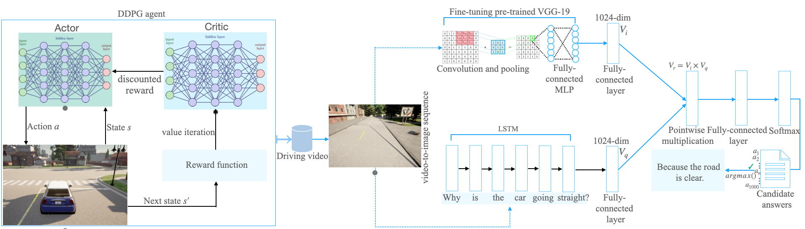

## Explaining Autonomous Driving Actions with Visual Question Answering

In this repository, we present the first empirical study on explaining autonomous driving actions using a VQA approach. Given an action performed by a self-driving car within a driving scene, and a causal question asked about such an action, the VQA framework predicts a correct answer for that chosen action. This repository contains the source code and related resources for our paper entitled "[Explaining Autonomous Driving Actions with Visual Question Answering](https://arxiv.org/abs/2307.10408)", which has been accepted for publication in the 2023 IEEE International Conference on Intelligent Transportation Systems (IEEE ITSC-2023) in Bilbao, Spain.




## The framework at a high level
**Input:** a driving frame and a question associated with an action performed in that frame  <br>
**Output:** The model's top five predictions (i.e., answers) for the asked question on that action in the frame with corresponding softmax probability scores.
## Setup

Firstly, we need to get the MS COCO files for training the VGG-19 architecture on it. In order to get the MS COCO files, we need to go to  the ```src/utilities``` folder and execute ``` download_and_unzip_datasets.csh ```. The commands inside this script file will download the MS COCO images. Once this step is completed,  execute the ```make_vocabs_for_questions_answers.py``` file. This script will generate the question and answer vocabularies for the MS COCO images. <br>
The next step is to train the VQA network on the MS COCO images using the ```src/vqa_notebook_train_MSCOCO.ipynb``` script and save the PyTorch model. In our case, it took  nearly ~ 36 hours to train the MS COCO images with 50 epochs on a machine with a NVIDIA RTX 3090 GPU and a 32 GB memory size. We then fine-tune this model using the ```src/VQA_finetune_with_driving_frames.ipynb``` script. Fine-tuning took several minutes to finish as we have only 250 training frames.

## Dataset
To obtain driving data, we ran the [Deep Deterministic Policy Gradient (DDPG)](https://arxiv.org/pdf/1509.02971.pdf) algorithm on [CARLA 0.9.11](https://carla.readthedocs.io/en/0.9.11/). While an autonomous car was operating in its environment, we recorded its driving video that shows the vehicle's field of view (FoV) in each instantaneous step. In this version, we  focus on five action categories: Go straight, turn left, turn left at T-junction, turn right, and turn right at T-junction. We further convert the collected driving video to image sequences uniformly at a default frame rate, and annotate the actions performed in each driving scene (i.e., frame) with question-answer pairs. Thus, our released dataset consists of the following parts:

**Training Data:** 250 frames from the autonomous car's driving on  Town 1 (```VQA-AD/src/Training Data/```)  <br>
**Test Data:** 100 frames from the autonomous car's driving on Town 1 and Town 2 (```VQA-AD/src/Testing Data/```) <br> 
**VQA Annotation:** CSV files that contain question-answer pairs, and image paths (```VQA-AD/src/VQA annotations/```) <br>
**Vocabulary:** The vocabulary files that keep  question and answer vocabularies, respectively.

## Reproducing the results
Once the steps in the Setup section are finished,  you can easily reproduce the model's predicton using```VQA-AD/src/VQA_Inference.ipynb``` code. There you can get the answers for the tested 100 action/question pair and see the model's overall performance. Please, remember that you will need a decent GPU and RAM along with the NVIDIA CUDA toolkit in order to run our source code on your machine.

## Implications
By using the presented framework, you can easily test our model on your simulation-based or even real autonomous driving datasets as well. In this case, make sure that you annotate other action categories with the relevant QA pairs, accordingly.

## References
[VQA: Visual Question Answering](https://openaccess.thecvf.com/content_iccv_2015/html/Antol_VQA_Visual_Question_ICCV_2015_paper.html) • [VQA GitHub](https://github.com/SatyamGaba/visual_question_answering) • [DDPG](https://arxiv.org/pdf/1509.02971.pdf)


## Paper:

    @article{atakishiyev2023explaining,
        title={Explaining Autonomous Driving Actions with Visual Question Answering},
        author={Atakishiyev, Shahin and Salameh, Mohammad and Babiker, Housam and Goebel, Randy},
        journal={arXiv preprint arXiv:2307.10408},
        year={2023}
    }
